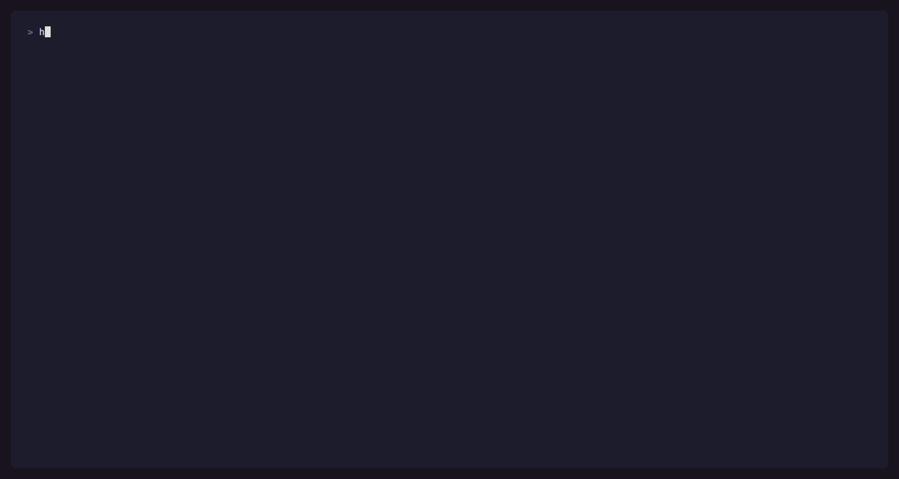
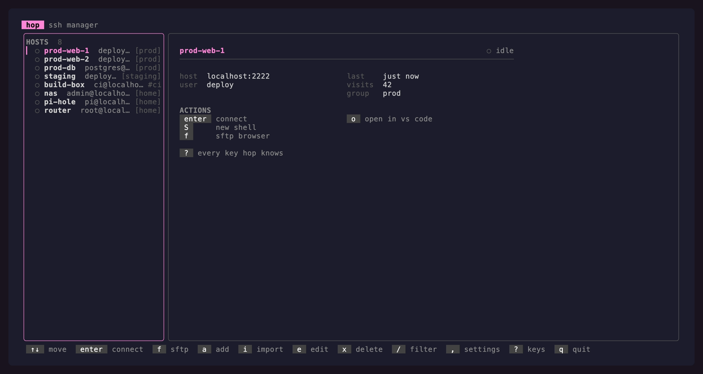
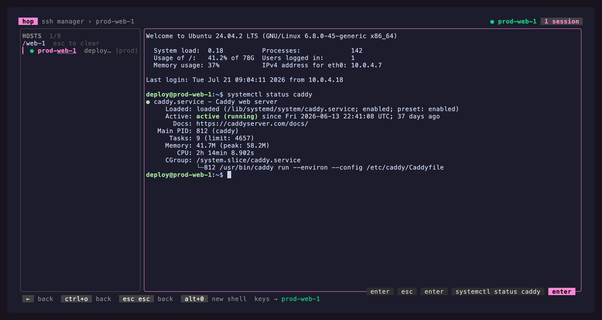
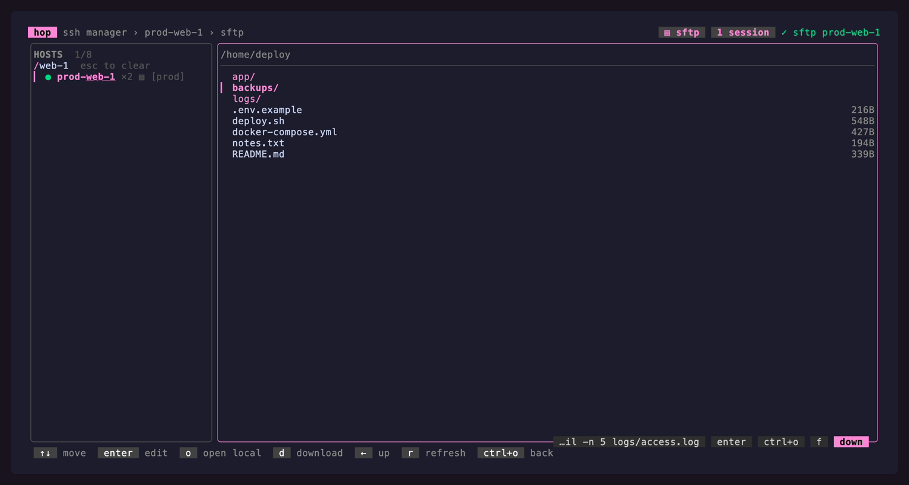
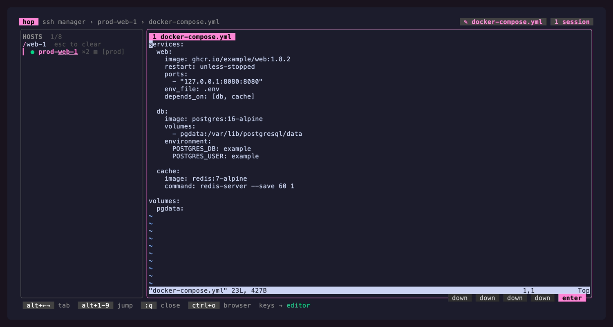
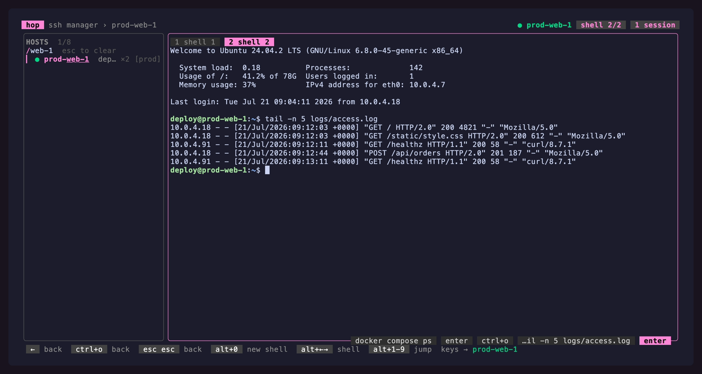
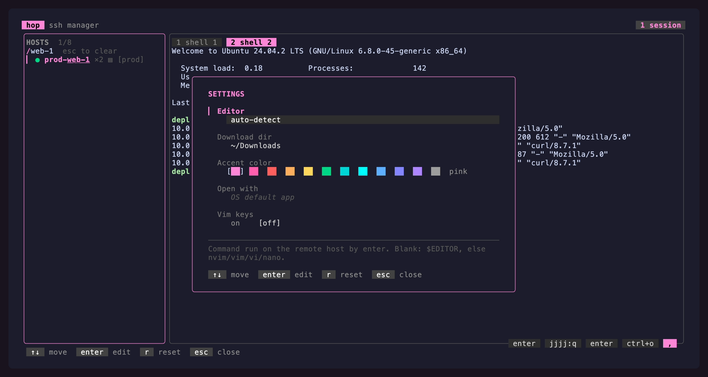
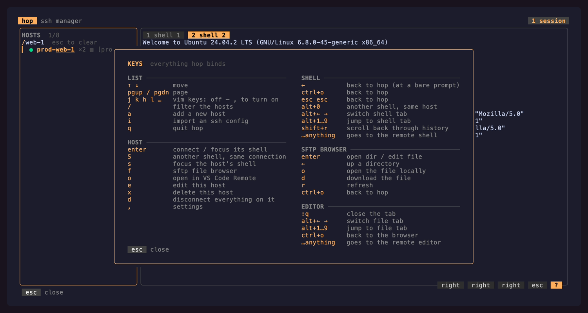

<div align="center">
<p align="center">
  
</p>

<h1 align="center">hop</h1>

**Hop from server to server without ever leaving your terminal.**

One keypress and you're in a shell. One more and you're browsing its files. One more and
you're editing one *on the box*, in a tab, beside all the others. Then hop to the next
host and everything you left behind is still exactly where you left it.

*No new windows. No re-authenticating. No hunting for that one shell you had open.*

[](https://github.com/p-arndt/hop/actions/workflows/ci.yml)
[](https://github.com/p-arndt/hop/actions/workflows/release.yml)
[](go.mod)
[](#-install)
[](https://github.com/charmbracelet/bubbletea)

[Install](#-install) · [Quick start](#-quick-start) · [Keys](#-keys) · [Development](#-development) · [Roadmap](#-roadmap)

</div>

---

> [!NOTE]
> **hop is in early development.** Things may break, change, or behave in ways they
> shouldn't. If you hit a bug, have an idea, or something just feels off,
> [open an issue](https://github.com/p-arndt/hop/issues)! Feedback at this stage is
> genuinely the most useful thing you can contribute. 🙌

## 🎬 What it looks like

<p align="center">
  
</p>

<sub>Keys are shown bottom-right as they're pressed. `●` connected · `◐` connecting ·
`○` idle · `×2` two shells open · `▤` SFTP browser open · `⇄2` two tunnels running</sub>

The header always tells you **where your keystrokes are going**. That's the single most
disorienting thing about a TUI that embeds other people's programs, so it gets permanent
screen space.

<table>
<tr>
<td width="50%" valign="top">
  <br>
  <sub><b>The host list.</b> Status dot, group, and what <code>enter</code> would do to the host under the cursor.</sub>
</td>
<td width="50%" valign="top">
  <br>
  <sub><b>A shell.</b> A real terminal in the pane; the footer shows the three ways back out.</sub>
</td>
</tr>
<tr>
<td width="50%" valign="top">
  <br>
  <sub><b>The SFTP browser.</b> <code>f</code>, over the connection that's already open.</sub>
</td>
<td width="50%" valign="top">
  <br>
  <sub><b>A remote editor tab.</b> <code>enter</code> on a file runs the editor <i>on the server</i>, so <code>:w</code> writes the real file.</sub>
</td>
</tr>
</table>

<details>
<summary><b>More stills</b>: two shells on one connection, settings, the keys card</summary>
<br>

<table>
<tr>
<td width="50%" valign="top">
  <br>
  <sub><b>Two shells, one connection.</b> <code>S</code> (or <code>ctrl+o</code> <code>0</code>) opens another channel, no second handshake.</sub>
</td>
<td width="50%" valign="top">
  <br>
  <sub><b>Settings.</b> <code>,</code>. The accent is a swatch strip that recolours hop as you walk it.</sub>
</td>
</tr>
<tr>
<td width="50%" valign="top">
  <br>
  <sub><b>Every key hop binds.</b> <code>?</code>. It lists the keyboard you actually have, with vim motions included only if you turned them on.</sub>
</td>
<td width="50%"></td>
</tr>
</table>

</details>

<sub>Everything in the recording is invented: it runs against a throwaway SSH server
(`tools/demoserver`) with a HOME of its own, so `just demo` re-records it anywhere without
exposing anything.</sub>

## ✨ Features

|  | |
| --- | --- |
| 🖥️ **Embedded SSH shells** | Real terminals in a pane — pure-Go SSH client, real VT emulator. Agent or key auth. |
| 🔑 **2FA and passwords** | A card appears the moment the host asks. Nothing stored, one prompt per host. |
| 🗂️ **Multiple shells per host** | `S` opens a second channel on the same connection — no new handshake, no second auth. |
| 📁 **SFTP file browser** | `f` browses the remote filesystem over the connection you already have. |
| ⇄ **Local & remote tunnels** | Define forwards per host with `T`, start/stop them with `t`. Imported from SSH config, restored on reconnect. |
| 🛰️ **ProxyCommand & ProxyJump** | Bastions and brokers (`aws ssm`, `cloudflared`, `gcloud`) work as your SSH config describes them. |
| ✎ **Remote editor tabs** | `enter` on a file runs `$EDITOR` *on the server* in a tab. No download — `:w` writes the real file. |
| 📂 **VS Code where you are** | `ctrl+o` `ctrl+o` opens VS Code Remote in the directory the shell is standing in, tracked over OSC 7. |
| 🏠 **A directory to land in** | Give a host a default directory and every session on it starts there. |
| ⇅ **Scrollback** | `shift+↑` pauses a shell into its history, with vim-ish paging. |
| 🔁 **Reconnect after a drop** | Drops are noticed, the last screen is kept, and `r` puts the shells, browser and tunnels back. |
| 🔐 **Honest host keys** | An unknown key aborts the dial and shows a fingerprint card. A mismatch is always a hard error. |
| 📥 **SSH config import** | `i` syncs hosts from `~/.ssh/config` — re-import refreshes, hand-added hosts are left alone. |
| 🔎 **Fuzzy find** | `/` filters as you type, with the matched characters picked out. |
| 🖱️ **Mouse** | Wheel, click and drag-to-copy everywhere; remote programs that want the pointer get it verbatim. |
| 📋 **Copy and paste** | Bracketed paste (even on Windows), drag to copy, and remote yanks (OSC 52) land on your clipboard. |
| ⚙️ **Live settings** | `,` — editor, download dir, accent colour, vim keys, mouse, remote clipboard. Applied on the spot. |
| 🎯 **Frecency ordering** | The hosts you actually use float to the top. |
| 🪟 **Cross-platform** | Static, dependency-free binaries for Windows, macOS and Linux (amd64 + arm64). |
| ⌨️ **Opt-in vim keys** | Off by default. Flip one switch and the motions appear everywhere at once. |

<details>
<summary>The longer version of a few of these</summary>
<br>

**2FA.** The dial waits inside the handshake rather than restarting — a one-time code is
only good once. One prompt per host, since shells, SFTP, editors and tunnels ride the same
connection.

**ProxyCommand.** The command runs *without a shell*: a line needing one is refused with a
clear error, so an imported config can't smuggle in `sh -c`. `%h` `%p` `%r` `%n` are
expanded. A `ProxyJump` may name another hop host by alias and borrows its user, port and key.

**OSC 7.** hop installs the prompt hook into bash/zsh itself — one line typed at the first
prompt, then wiped from the pane, so the session looks untouched. Nothing is typed into a
shell that already emits OSC 7, or while a full-screen program owns the screen. Where no
directory can be learned, the key still opens the host in its default directory and says so.

**Reconnect.** Drops are found with keepalive probes rather than silence, so a suspended
laptop or dead VPN doesn't leave a pane quietly frozen.

</details>

## 📦 Install

### Download a binary

Grab the archive for your platform from the [latest release](https://github.com/p-arndt/hop/releases/latest)
and put `hop` somewhere on your `PATH`.

```bash
# macOS / Linux
tar -xzf hop_*_darwin_arm64.tar.gz
sudo mv hop /usr/local/bin/
```

```powershell
# Windows
Expand-Archive hop_*_windows_amd64.zip -DestinationPath .
# then move hop.exe onto your PATH
```

Every release ships a `hop_<version>_checksums.txt`, so you can verify with `sha256sum -c`.

### Staying current

```bash
hop check-update   # is there a newer release?
hop self-update    # download it, verify its checksum, swap this binary
```

`self-update` pulls the archive for your platform from the latest release, verifies its
SHA-256 against that release's `checksums.txt`, and swaps the running binary atomically.
Source builds (`version = dev`) are refused. hop also checks once a day in the background;
`HOP_NO_UPDATE_CHECK=1` turns that off.

### From source

Needs [Go 1.26+](https://go.dev/dl/) (and optionally [`just`](https://github.com/casey/just) ≥ 1.39).

```bash
git clone https://github.com/p-arndt/hop.git && cd hop
just build          # -> ./hop   (or: go build -o hop .)
just build-release  # stripped + version-stamped
```

## 🚀 Quick start

```bash
hop            # launch the TUI
```

On a first run with no hosts, hop offers to import `~/.ssh/config` for you: one
`enter` and your list is full. There's a CLI too, for when you're already in a shell:

```bash
hop import              # sync hosts from ~/.ssh/config
hop import path/to/cfg  # …or from somewhere else
hop add web1 deploy@10.0.0.4:2222
hop list                # alias  user@host:port
hop check-update        # is a newer release out?
hop self-update         # upgrade this binary in place
hop version
```

Then, in the TUI: `↑`/`↓` to move, `enter` to connect, `ctrl+o` to come back out.
That's the whole model.

### Where things live

| | Path |
| --- | --- |
| Host database | `<config dir>/hop/hop.db` (SQLite) |
| Settings | `<config dir>/hop/config.json` (plain JSON, hand-editable) |
| Update check cache | `<config dir>/hop/update-check.json` (last check + latest version seen) |
| Known hosts | your usual `~/.ssh/known_hosts` |

`<config dir>` is `%AppData%\hop\` on Windows, `~/Library/Application Support/hop/`
on macOS, `~/.config/hop/` on Linux. A missing or malformed config file starts hop
on defaults rather than refusing to start.

## ⌨️ Keys

hop has three modes, and the footer always shows the keys for the one you're in.
Every mode returns to the host list with **`ctrl+o`**.

| Mode | You're here when | Who owns your keystrokes |
| --- | --- | --- |
| **Navigation** | the host list is focused (the default) | hop |
| **Browsing** | you opened the SFTP browser with `f` | hop |
| **Terminal** | you connected with `enter` or `s` | the **remote shell** |

<details>
<summary><b>The host list</b></summary>

| Key | Action |
| --- | --- |
| `↑` `↓` / `pgup` `pgdn` | move / page |
| `enter` `→` | connect, or focus the shell already open |
| `s` / `S` | focus this host's session / open **another** shell on it |
| `f` | SFTP browser |
| `t` / `T` | start or stop all tunnels / manage their definitions |
| `o` | open in VS Code Remote, in the directory this host's shell is in |
| `d` | disconnect |
| `r` | reconnect a session whose connection dropped |
| `a` `e` `x` | add / edit / delete a host |
| `i` | import from an OpenSSH config |
| `/` | fuzzy filter |
| `,` `?` | settings / keys card |
| `ctrl+b` | hide / show the sidebar |
| `ctrl+g` | hand the mouse to your terminal (and take it back) |
| `q` `ctrl+c` | quit |

</details>

<details>
<summary><b>Inside a shell</b></summary>

| Key | Action |
| --- | --- |
| `ctrl+o` | the **leader** — opens hop's menu, does nothing on its own |
| `ctrl+o` `o` | out, back to hop |
| `esc` `esc` | back to hop (within 400 ms) |
| `shift+←` `shift+→` | switch shells |
| `ctrl+o` `1…9` | straight to that shell, without leaving the pane |
| `ctrl+o` `0` | another shell on this host, without leaving the pane |
| `ctrl+o` `c` | open **this directory** in VS Code Remote |
| `shift+↑` / `shift+pgup` | into scrollback |
| `ctrl+b` | hide the sidebar — the shell takes the whole window |
| `ctrl+g` | hand the mouse to your terminal (and take it back) |
| *everything else* | goes to the remote shell |

`ctrl+o` `ctrl+o` opens VS Code Remote on the directory the shell is standing in —
`cd` somewhere, `ctrl+o` out of the pane, `ctrl+o` again. (Only a chord because the remote
shell owns every plain key.) Full reference: [KEYBINDINGS.md](KEYBINDINGS.md).

</details>

<details>
<summary><b>The file browser & editor tabs</b></summary>

| Key | Action |
| --- | --- |
| `enter` `→` | enter a directory, or open a file in a remote editor tab |
| `o` / `d` | open in the local desktop app / download |
| `←` `backspace` | up one directory |
| `r` | refresh |
| `ctrl+b` | hide / show the sidebar |
| `shift+←` `shift+→` | switch editor tabs |
| `ctrl+o` `o` | back to the browser |
| `:q` | close an editor tab |
| `ctrl+o` | back one level |

</details>

<details>
<summary><b>When a connection drops</b></summary>

| Key | Action |
| --- | --- |
| `r` `enter` | reconnect and reopen what was open |
| `d` `x` | drop the session — the host goes back to idle |
| `ctrl+o` `esc` `q` | back to the host list, pane left on screen |

The pane keeps the last screen the host drew, under a banner saying what happened.
Nothing is forwarded to the far end, because there is no far end.

</details>

📖 **[KEYBINDINGS.md](KEYBINDINGS.md)** is the full reference, including the vim
motions, the settings popover, and *why* each reserved chord is reserved.

## 🛠️ Development

```bash
just            # list recipes
just run list   # go run . list
just build      # dev binary
just test       # go test ./...
just test-e2e   # + the Docker 2FA end-to-end tests (needs Docker)
just vet
just fmt        # gofmt -w .
just ci         # fmt-check + vet + test (what CI runs)
just demo       # re-record assets/demo.gif + the stills (needs vhs)
```

<details>
<summary>How the demo, the tests and the release are put together</summary>
<br>

**The justfile** is deliberately universal: recipe bodies run under both `sh` and
PowerShell, and the two that need real shell logic (`fmt-check`, `clean`) are split with
`[unix]` / `[windows]` attributes.

**The demo.** `just demo` records the GIF and the stills. `scripts/demo.mjs` builds hop,
points `HOME` at a throwaway directory with a seeded host database, and starts
`tools/demoserver` — a loopback-only SSH server with a fake shell, an in-memory SFTP
filesystem and a fake vi. The keypress overlay is compiled in only under `-tags hopdemo`
(`internal/tui/keycast.go`), so released binaries don't carry it.

**Testing.** Headless tests drive the real Bubble Tea model with real keystrokes against
in-process Go SSH/SFTP servers and temp-file stores — see `internal/tui/hostmgmt_test.go`,
`TestEmbeddedRoundTrip`, `TestSFTPRoundTrip`.

**The 2FA end-to-end tests.** An in-process server that answers whatever you tell it to
proves nothing about real two-factor auth, so `internal/dockerenv` brings up Ubuntu with
the real `openssh-server` and `libpam-google-authenticator`, listening four ways: code
alone, hardened `publickey,keyboard-interactive`, password-then-code, and both offered as
alternatives. The tests compute TOTP codes the way a phone does and log in, with wrong and
expired codes as negative controls. Opt in with `just test-e2e`; without `HOP_DOCKER_E2E=1`
they skip.

**Releasing.**

```bash
just release          # patch bump: stamps VERSION, commits, tags, pushes
just release minor    # or major, or an explicit 1.0.0
```

The tag push gates on a Windows / Linux / macOS test matrix, then cross-compiles all six
targets from one Linux runner with checksums and a git-cliff changelog.

</details>

## 🗺️ Roadmap

Next up:

- 💓 **Health panel**: per-host reachability, latency, uptime and disk
- ⬆️ **Uploads & file ops** in the browser (`u`, `x`, `R`, `m`) with async transfer progress
- 🏷️ **Groups & tags** in the list: section by group, filter by tag, pin favourites
- 📐 Narrow-terminal layouts and cursor-style fidelity

The living version, with far more detail on each item, is [TODO.md](TODO.md).

## 🙏 Built with

[Bubble Tea](https://github.com/charmbracelet/bubbletea) · [Lip Gloss](https://github.com/charmbracelet/lipgloss) ·
[x/vt](https://github.com/charmbracelet/x) · [x/crypto/ssh](https://pkg.go.dev/golang.org/x/crypto/ssh) ·
[pkg/sftp](https://github.com/pkg/sftp) · [modernc.org/sqlite](https://gitlab.com/cznic/sqlite) ·
[sahilm/fuzzy](https://github.com/sahilm/fuzzy) · [skeema/knownhosts](https://github.com/skeema/knownhosts)

<div align="center">
<sub>Made for people with too many servers and not enough terminals.</sub>
</div>
