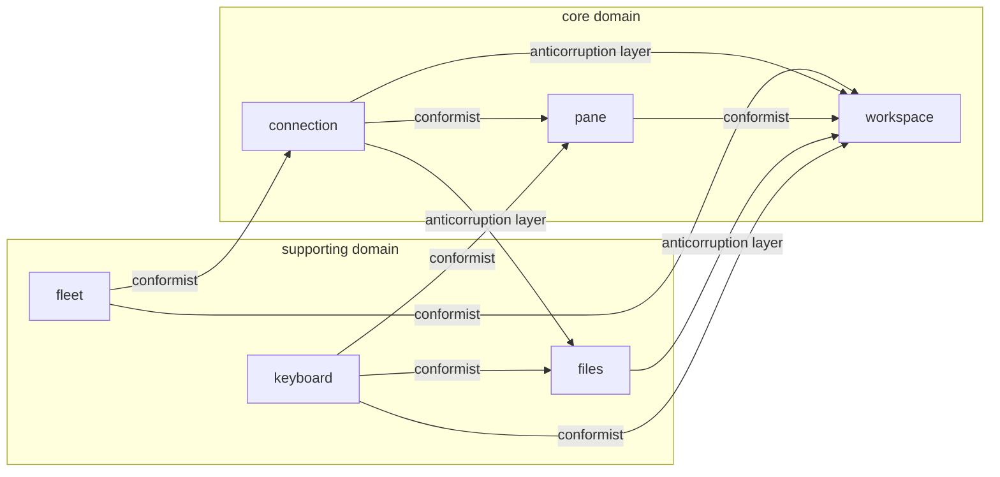

# Domain model

hop's domain, as the code already has it. This model was **bootstrapped from an
existing codebase**: the boundaries below were read off the package graph, the change
history and — most usefully — the words the code uses. Nothing here was invented.
Everything uncertain is marked under each context's **Assumptions**.

Read this before touching code you do not know. Update it when a boundary, a name, or
a business rule changes — not "later".

## Contexts

| Context | Subdomain | Owner | Purpose | Code |
|---|---|---|---|---|
| [connection](contexts/connection/) | core | p-arndt | One SSH transport per host; everything else is a channel on it. Auth and host-key trust. | `internal/sshx` |
| [pane](contexts/pane/) | core | p-arndt | Somebody else's program, running on a server, drawn faithfully inside hop. | `internal/terminal` |
| [workspace](contexts/workspace/) | core | p-arndt | Where am I and where are my keystrokes going — arrangement, focus, and continuity across hops. | `internal/tui` |
| [fleet](contexts/fleet/) | supporting | p-arndt | Which machines can I hop to, and which one do I want right now. | `internal/store`, `internal/config` |
| [files](contexts/files/) | supporting | p-arndt | Browsing and moving files on the server, without downloading them to look at them. | `internal/filebrowser`, `internal/sftpx` |
| [keyboard](contexts/keyboard/) | supporting | p-arndt | What does this key mean, right now — one table, read by the app and the docs. | `internal/keys` |

## Context map

The graph is acyclic and matches the Go import graph exactly, which is the strongest
evidence these boundaries are real rather than wished for. Every edge points at
`workspace`, which is both the design (it is the coordinator) and the problem (see below).

## Subdomain strategy

| Subdomain type | Contexts | What that means for us |
|---|---|---|
| Core | connection, pane, workspace | The product's three promises: one connection per host, faithful embedded terminals, nothing lost when you hop away. Deepest model, best tests, own forever. |
| Supporting | fleet, files, keyboard | Necessary and hop-specific, but nobody chooses a terminal for them. Build simply; boring code is correct code here. |
| Generic | `internal/action`, `internal/clipboard`, `internal/update`, `internal/buildinfo`, `internal/pathx`, `internal/dockerenv` | Launching VS Code, the local clipboard, self-update, version strings, tilde expansion, and test-only Docker fixtures. **Not modelled on purpose.** A paragraph is all they are worth; custom depth here is money burnt. |

## What this bootstrap found

Three things worth a human's attention:

1. **`internal/tui` is a god package.** 9,055 lines and present in 567 of the
   package-level file changes in 149 commits — more than triple the next package. It
   has been carved here into `workspace` plus files claimed by `fleet`, `connection`,
   `pane` and `keyboard`, **by which language each file speaks**. That carve is the
   model's biggest bet.
2. **Two collisions are load-bearing**, and an agent asked to "clean up naming" would
   destroy both: `Session` (a shell channel vs. everything hop holds for a host) and
   `Client` (the transport vs. the SFTP subsystem vs. the browser's port). They are in
   [`glossary.md`](glossary.md) precisely so nobody unifies them.
3. **`internal/filebrowser` and `internal/sftpx` are modelled as one context**, joined
   by the `filebrowser.Client` port. If a second implementation of that port ever
   appears, that is the signal to split them.

## How to work with this model

1. Before changing code in a context, read that context's `README.md` and `language.md`.
2. Use the context's words in code, tests, commits and PRs. If the word is wrong, fix
   the word first. If the word is missing, add it before you use it.
3. Check [`glossary.md`](glossary.md) before renaming anything that appears in more
   than one package.
4. After the change, update the affected sections and run
   `python3 <skill>/scripts/ddd.py verify <files>`.
5. `ddd check` reports drift. Drift is a build signal, not a chore.

## Status

Every context here is **`status: draft`**. Drafts are a reading of the code, not an
agreement with a human. Each one carries an **Assumptions** section — those are the
conversation this model exists to start. Promote a context to `agreed` only after
someone has had that conversation.
